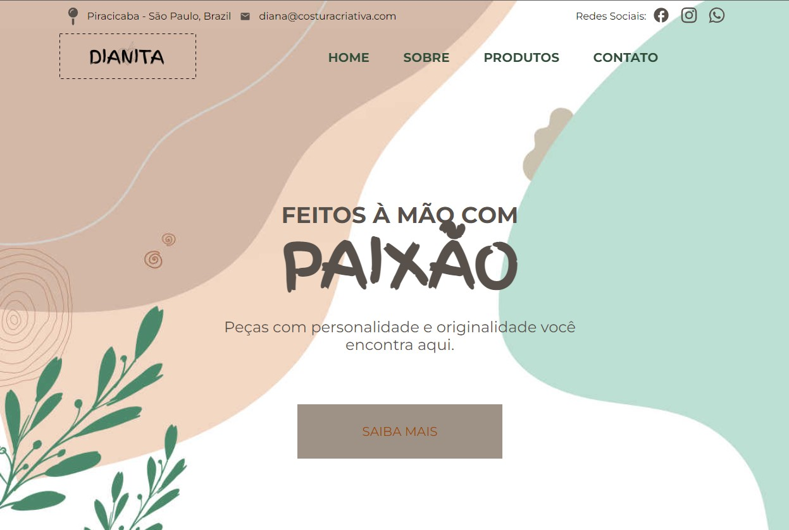
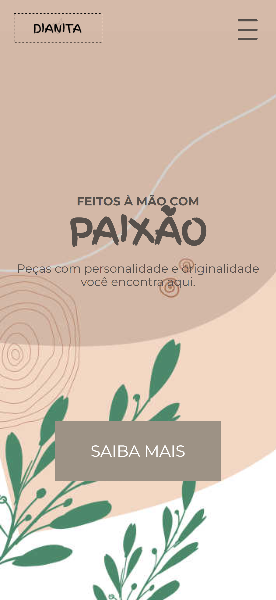
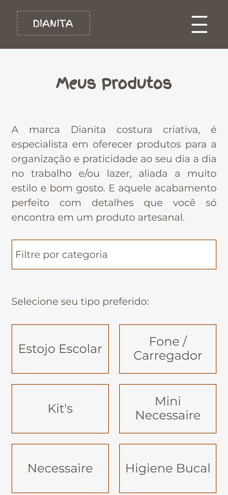
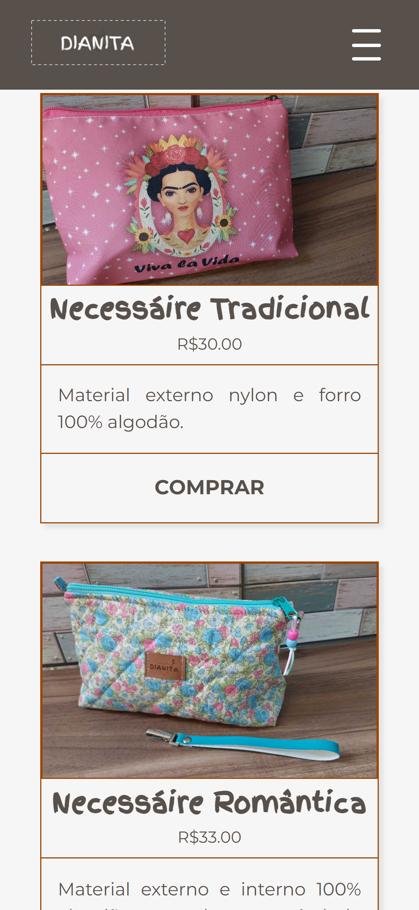
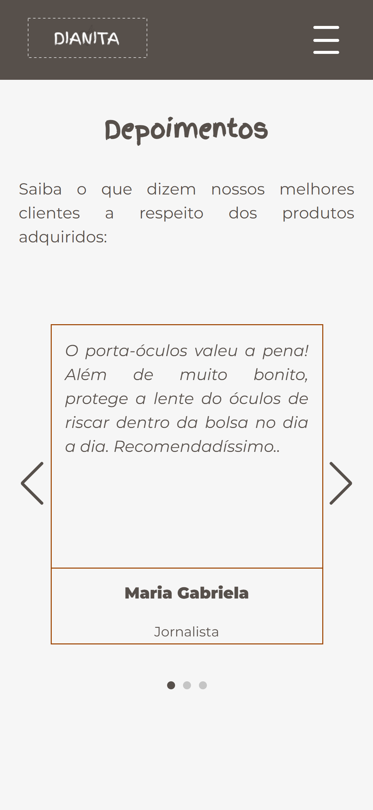
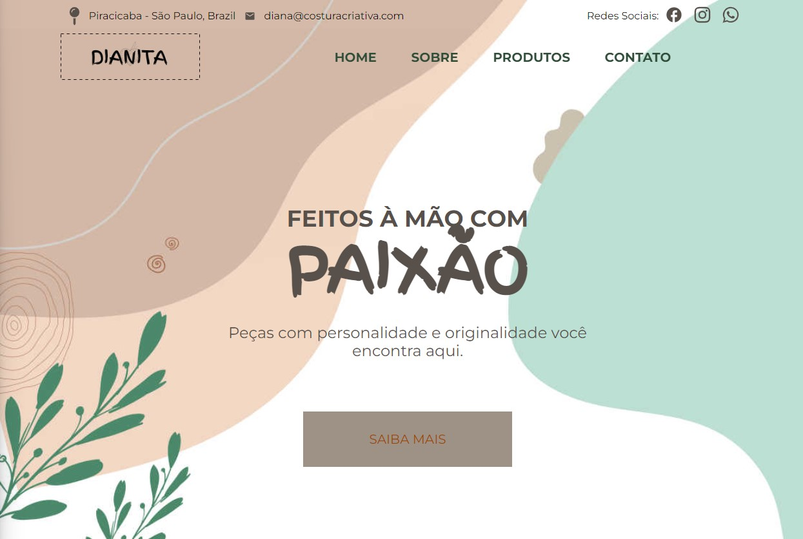
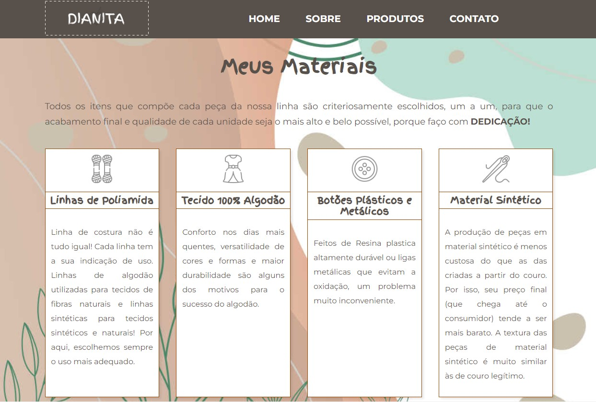
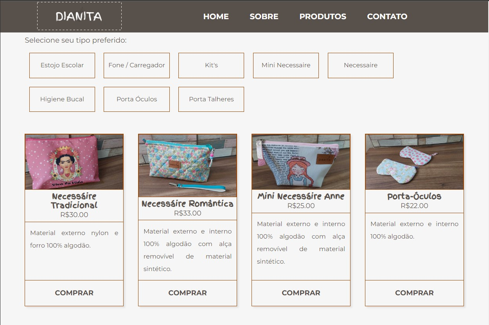
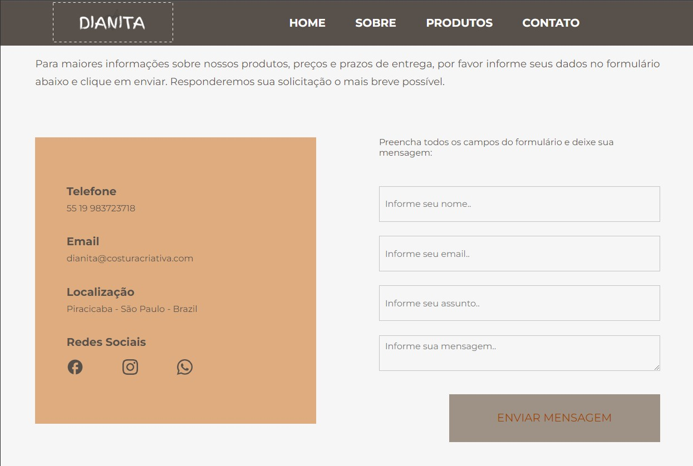

<h1 align="center">
  
</h1>

# Dianita Costura Criativa

<h4 align="center"> 
  Site institucional de catálogo de Produtos. <br />
	🚧  Status - Concluído 🚀 🚧
  <br />
  <a href="https://dianitacosturacriativa.com.br/" target="_blank">🔗 Acesse o site aqui!
</a>
</h4>


---
## Índice
<br />

- <a href="#-sobre-o-projeto">Sobre</a>
- <a href="#-funcionalidades">Funcionalidades</a> 
- <a href="#-layout">Layout</a>
- <a href="#-como-executar-o-projeto">Como executar o projeto localmente</a>
- <a href="#-tecnologias">Tecnologias</a> 
- <a href="#-autor">Autor</a>
---

## 💻 Sobre o projeto

Projeto desenvolvido com o intuito de expandir os canais de comunicação, fazer mais vendas através da paginação dos produtos e ser encontrado nas pesquisas do Google como referência local! ❤️❤️❤️

---

## ⚙️ Funcionalidades

- [x] Quem somos
- [x] Meus Materiais
- [x] Meus Produtos
- - [x] Filtro de produtos por categorias
- - [x] Listagem de produtos
- - [x] Botão de ação de compra
- [x] Poílítica de devolução
- [x] Localização
- [x] Depoimentos
- [x] Formulário de contato
---

## 🎨 Layout 

O layout da aplicação está disponível no Figma:

<a href="https://www.figma.com/file/8LOxCXiShJeCFNWfYq9mS8/Untitled?node-id=0-1&t=ghCegPOQEenAFRPn-0">
  
</a>

---

## 📱 Mobile

<p align="center">
  
  
  
  
</p>

### 💻 Web

<p align="center">
  
  
  
  
</p>

---

## 🚀 Como executar o projeto

Este projeto possui apenas o Frontend

Antes de começar, você vai precisar ter instalado em sua máquina as seguintes ferramentas:

- [Git](https://git-scm.com)<br />
- [Node.js](https://nodejs.org/en/)

Além disto, é bom ter um editor de código para trabalhar com o código como o [VSCode](https://code.visualstudio.com/) .

#### 🎲 Rodando o Frontend 

```bash

#Clone o repositório: 
$ git clone git@github.com:thiago-mfernandes/Dianita-Costura-Criativa.git

#Acesse a pasta do projeto pelo terminal/cmd
$ cd Dianita-Costura-Criativa

#Acesse a subpasta
$ cd diana-costura-criativa

#Instale as dependências do projeto
$ npm install

#Execute a aplicação em modo de desenvolvimento
$ npm start

# O servidor inciará na porta:3000 - acesse http://localhost:3000

```
---

## 🛠 Tecnologias

As seguintes ferramentas foram usadas na construção do projeto:

#### **Website**  

- **[React](https://reactjs.org/)**

- **[Typescript](https://www.typescriptlang.org/)**

- **[Jest](https://jestjs.io/pt-BR/)**

- **[Rocketseat Unform](https://github.com/unform/unform)**

- **[Emailjs](https://www.emailjs.com/)**

- **[Framer Motion](https://www.framer.com/motion/)**

- **[Sass](https://sass-lang.com/)**

#### **Utilitários**

- **[React Icons](https://react-icons.github.io/react-icons/)**

- **[Json Server](https://github.com/typicode/json-server)**

- **[React Anchor Smooth Scroll](https://www.npmjs.com/package/react-anchor-link-smooth-scroll-v2)**

- **[Swiperjs](https://swiperjs.com/react)**


> Veja o arquivo [package.json](https://github.com/thiago-mfernandes/Dianita-Costura-Criativa/blob/main/diana-costura-criativa/package.json)

---

## 🦸 Autor


 
 <br />
 <sub>
  <b>Thiago Fernandes 🚀</b>
 </sub>
 

 
[](https://www.linkedin.com/in/thiago-mello-fernandes-frontend-react-js-javascript/)
---

## 📝 Licença


Feito com ❤️ por Thiago Fernandes 👋🏽 [Entre em contato!](https://whatsa.me/5519984009105)

---

